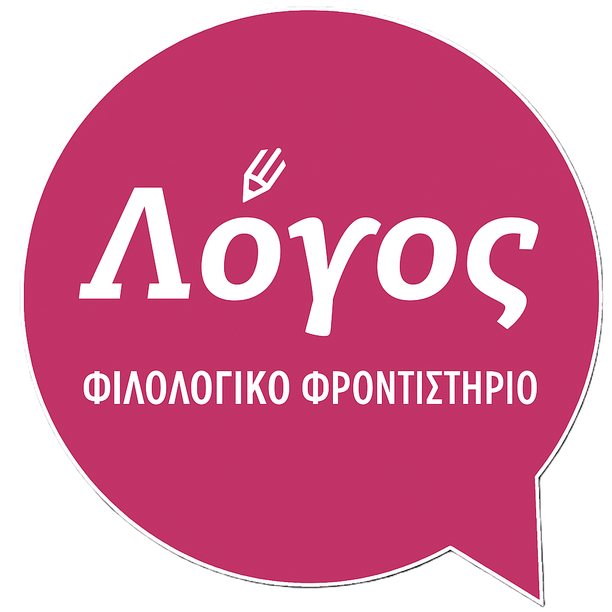

# Φιλολογικό Φροντιστήριο Λόγος - Ιστοσελίδα
<p align="center">
  
</p>

<p align="center">
  <strong>Ιστοσελίδα για το Φιλολογικό Φροντιστήριο Λόγος στη Δράμα.<br> 
Ο ιστότοπος έχει σχεδιαστεί για να παρέχει πληροφορίες για το φροντιστήριο, τους καθηγητές, τις υπηρεσίες, καθώς και άμεση πρόσβαση σε εκπαιδευτικό υλικό.</strong><br>
</p>

## Συνοπτική Δομή Φακέλων
Για να λειτουργεί σωστά η δυναμική ανάγνωση των αρχείων, τηρούμε την εξής δομή:

📂 **Assets:** (Λογότυπα, στατικές εικόνες σελίδας)<br>
📂 **Media:** (Οι φωτογραφίες που θα εμφανίζονται στο Carousel/Gallery)<br>
📂 **Programma_Spoudon:** (Τα αρχεία PDF με τα προγράμματα)<br>
📂 **Yliko:** (Το εκπαιδευτικό υλικό/σημειώσεις σε PDF, χωρισμένο ανά τάξη και μάθημα)<br>
📄 **index.html:** (Το κεντρικό και μοναδικό αρχείο της ιστοσελίδας)

## Δομή Φακέλου Yliko και Υποφακέλων

```
📂 Yliko/
├── 📂 Gymnasio/
│   ├── 📂 A_Gymnasiou/
│   │   ├── 📂 Nea_Ellinika/
│   │   │   ├── 📄 ... (αρχεία PDF)
│   │   ├── 📂 Arxaia/
│   │   │   ├── 📄 ... (αρχεία PDF)
│   │   ├── 📂 Istoria/
│   │   │   ├── 📄 ... (αρχεία PDF)
│   │   └── 📂 Logotexnia/
│   │   │   ├── 📄 ... (αρχεία PDF)
│   ├── 📂 B_Gymnasiou/
│   │   └── ... (αντίστοιχοι φακέλοι μαθημάτων με αρχεία)
│   └── 📂 G_Gymnasiou/
│       └── ... (αντίστοιχοι φακέλοι μαθημάτων με αρχεία)
│
├── 📂 Lykeio/
│   ├── 📂 A_Lykeiou/
│   │   ├── 📂 Nea_Ellinika/
│   │   │   ├── 📄 ... (αρχεία PDF)
│   │   ├── 📂 Arxaia/
│   │   │   ├── 📄 ... (αρχεία PDF)
│   │   ├── 📂 Istoria/
│   │   │   ├── 📄 ... (αρχεία PDF)
│   │   └── 📂 Logotexnia/
│   │   │   ├── 📄 ... (αρχεία PDF)
│   ├── 📂 B_Lykeiou/
│   │   └── ... (αντίστοιχοι φακέλοι μαθημάτων με αρχεία)
│   └── 📂 G_Lykeiou/
│       └── ... (αντίστοιχοι φακέλοι μαθημάτων με αρχεία)
│
└── 📂 EPAL/
│   ├── 📂 A_EPAL/
│   │   ├── 📂 Nea_Ellinika/
│   │   │   ├── 📄 ... (αρχεία PDF)
│   │   ├── 📂 Arxaia/
│   │   │   ├── 📄 ... (αρχεία PDF)
│   │   ├── 📂 Istoria/
│   │   │   ├── 📄 ... (αρχεία PDF)
│   │   └── 📂 Logotexnia/
│   │   │   ├── 📄 ... (αρχεία PDF)
│   ├── 📂 B_EPAL/
│   │   └── ... (αντίστοιχοι φακέλοι μαθημάτων με αρχεία)
│   └── 📂 G_EPAL/
        └── ... (αντίστοιχοι φακέλοι μαθημάτων με αρχεία)
```

## Δομή Φακέλου Programma_Spoudon και Υποφακέλων

```
📂 Programma_Spoudon/
├── 📂 Gymnasio/
│   ├── 📂 A_Gymnasiou/
│   │   ├── 📄 A_Gymnasiou.pdf
│   ├── 📂 B_Gymnasiou/
│   │   └── 📄 B_Gymnasiou.pdf
│   └── 📂 G_Gymnasiou/
│       └── 📄 G_Gymnasiou.pdf
│
├── 📂 Lykeio/
│   ├── 📂 A_Lykeiou.pdf/
│   │   ├── 📄 A_Lykeiou.pdf
│   ├── 📂 B_Lykeiou.pdf/
│   │   └── 📄 B_Lykeiou.pdf
│   └── 📂 G_Lykeiou.pdf/
│       └── 📄 G_Lykeiou.pdf
│
└── 📂 EPAL/
│   ├── 📂 A_EPAL/
│   │   ├── 📄 A_EPAL.pdf
│   ├── 📂 B_EPAL/
│   │   └── 📄 B_EPAL.pdf
│   └── 📂 G_EPAL/
│       └── 📄 G_EPAL.pdf
```

## Δομή Φακέλου Media
```
 Όσα αρχεία τοποθετούνται στον φάκελο εμφανίζονται στο καρουζέλ φωτογραφιών και στην γκαλερί
```

## Πνευματικά Δικαιώματα
Φιλολογικό Φροντιστήριο Λόγος. Όλα τα δικαιώματα διατηρούνται.<br>
Απαγορεύεται η αντιγραφή, αναδημοσίευση ή χρήση του κώδικα, των κειμένων, των φωτογραφιών και των λογοτύπων χωρίς ρητή άδεια.
